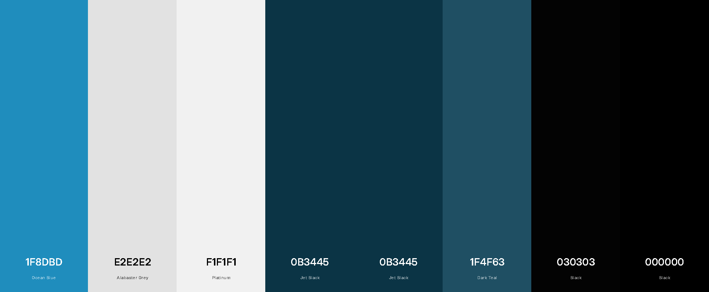
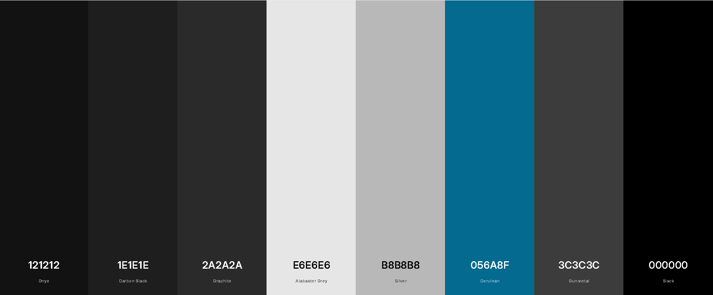

# My own weather app!
Click [HERE](https://ingvaldssonmattias.github.io/myOwnWeatherApp/) to view the page!

## WeatherApp 🌦️

A simple and stylish weather app that displays the current temperature, weather condition, and location information. Search for any city and switch between Celsius and Fahrenheit.

## Features

Display the current temperature and weather condition (e.g., cloudy, sunny, rain).

Search weather for any city with automatic suggestions.

Toggle between Celsius and Fahrenheit.

Light and dark theme toggle button.

Shows location and current time.

History of previous searches (sidebar).

## Technologies

HTML5

CSS3

JavaScript

## Icons
Remix Icon

Font Awesome

Google Fonts (Cherry Bomb One, Inter)

## Colors

| Lightmode | Hex Code 
|------------|----------|
|  Ocean Blue     | `#1f8dbd` |
|  Alabaster Grey | `#e2e2e2` |
|  Platinum       | `#f1f1f1` |
|  Jet Black      | `#0b3445` |
|  Jet Black      | `#0b3445` |
|  Dark Teal      | `#1f4f63` |
|  Black          | `rgba(3, 3, 3, 0.8)` |
|  Black          | `rgba(0, 0, 0, 0.2)` |

| Darkmode | Hex Code |
|------------|----------|
|  Onyx          | `#121212` |
|  Carbon Black  | `rgba(30, 30, 30, 0.9)` |
|  Graphite      | `#2a2a2a` |
|  Alabaster Grey| `#e6e6e6` |
|  Silver        | `#b8b8b8` |
|  Cerulean      | `#056a8f` |
|  Gun metal     | `rgba(60, 60, 60, 0.8)` |
|  Black         | `rgba(0, 0, 0, 0.6)` |

